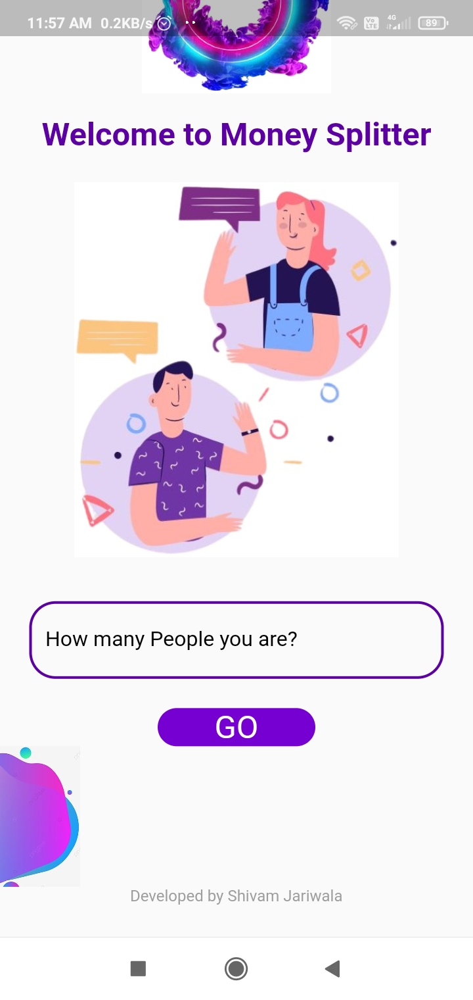
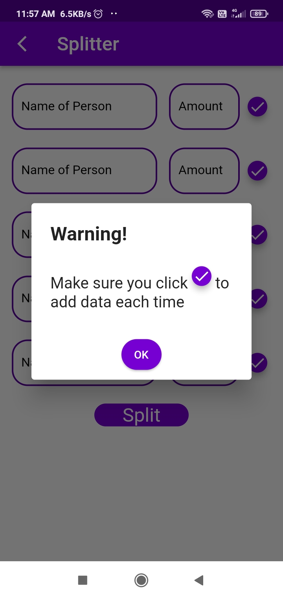
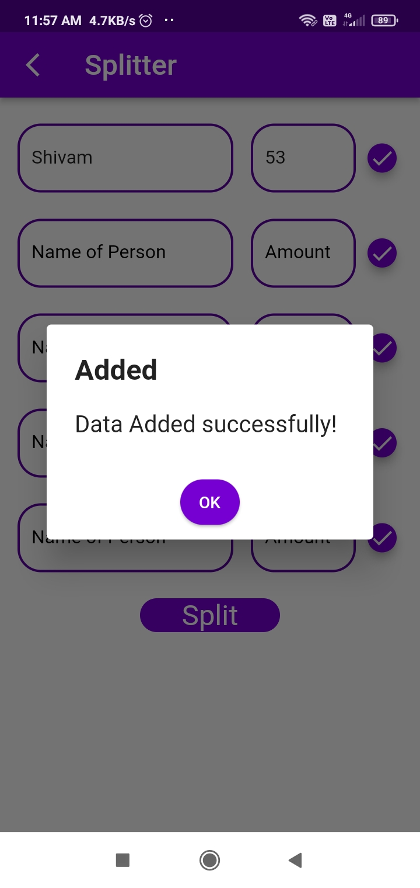
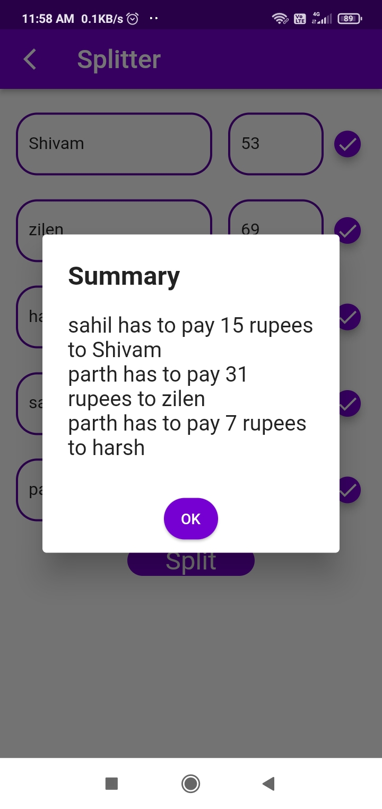

# Money Splitter

The app is made with flutter to split money among family and friends. When we go for outing, different person pays at different place. Finally, in order to sum up the total expense and divide them evenly, the app says "who needs to pay whom and how much" for even distribution.

You can download application by downloading "app-release.apk"

# Screenshots

  
  
  
  

